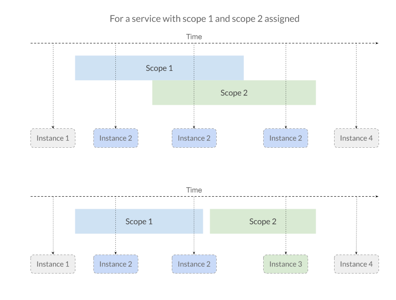

# Services scopes
When you declare a class as a service, you ask Diosaur to manage
its lifecycle. This is actually done with scopes.

## Singletons
By default every declared service is scoped as a singleton. This means
that whenever you request it, it will always resolve to the same instance.
A singleton service will live as long as your program lives.

```typescript
@Service({ scoping: 'singleton' }) // optional, it's singleton by default
class SingletonService {

    // Symbols are always different, see 
    // https://developer.mozilla.org/en-US/docs/Web/JavaScript/Reference/Global_Objects/Symbol
    public readonly sym = Symbol();
}

const container = await getContainer();
console.log(container.get(SingletonService) === container.get(SingletonService)); // true
console.log(container.get(SingletonService).sym === container.get(SingletonService).sym); // true
```

## Renewable
Renewable services will be re-created everythime they are retrieved. This means
that doing
```typescript
@Service({ scoping: 'renewable' })
class RenewableService {
    public readonly sym: Symbol();
}

// ...
console.log(container.get(RenewableService) === container.get(RenewableService)); // false
console.log(container.get(RenewableService).sym === container.get(RenewableService).sym); // false
```

## Custom scoped
The two previous scopes are often not enough to manage services lifecycle, that's
why Diosaur introduces custom scopes. You can assign custom scopes to your service:
```typescript
@Service({ scoping: 'custom', customScopes: ['scope1', 'scope2'] })
class CustomScopeService {
   public readonly sym: Symbol(); 
}
```

### Entering and exiting custom scopes
A custom scope is actually a period of time in which you can enter and from which
you can exit. You can do the following with:
```typescript
const instanceBefore = container.get(CustomScopeService);

// service has no assigned scope overlapping with any running custom scope
container.get(CustomScopeService) === container.get(CustomScopeService); // false

// Enter scope
container.enterScope('scope1');

container.get(CustomScopeService) === container.get(CustomScopeService); // true
container.get(CustomScopeService) === instanceBefore; // false

// Exit scope
container.exitScope('scope1');
```

- When you request a service outside of any of it's defined scopes (the ones you assigned
to it), custom scopes act as renewable, you'll always receive a new instance.
- When you request a service inside any of it's defined scopes, you'll receive the same instance.

## Overlapping custom scopes
You can have multiple scopes overlapping each other.
When a service is assigned multiple scopes which we enter and exit with both overlapping, **the service
instance is kept alive as long as one of its assigned scope is running.**


If there's an instance already created in *scope1* and we're exiting it, but *scope2* is still alive,
all services which have both *scope1* and *scope2* assigned will have their instances kept alive in *scope2*.

```typescript
container.enterScope('scope1');
container.enterScope('scope2');
container.exitScope('scope1');
container.exitScope('scope2');
```

If there's more scopes, Diosaur will simply take the first that match to transfer existing instances to.